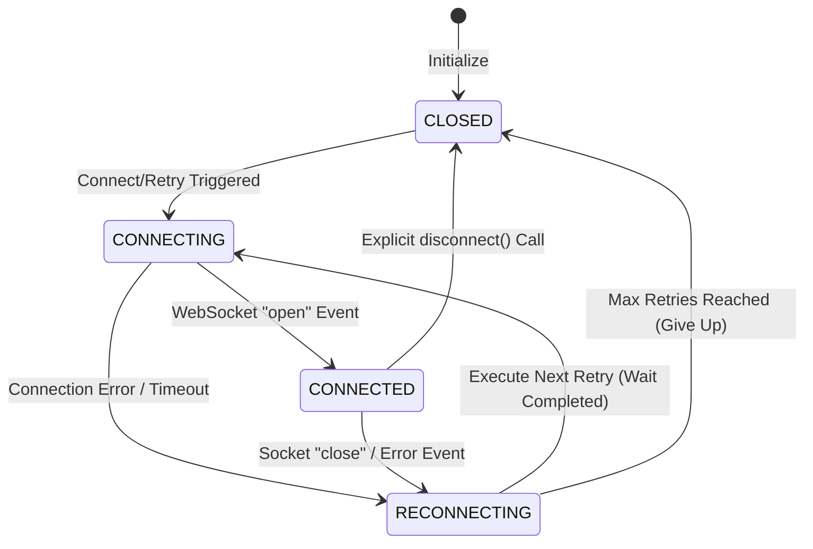
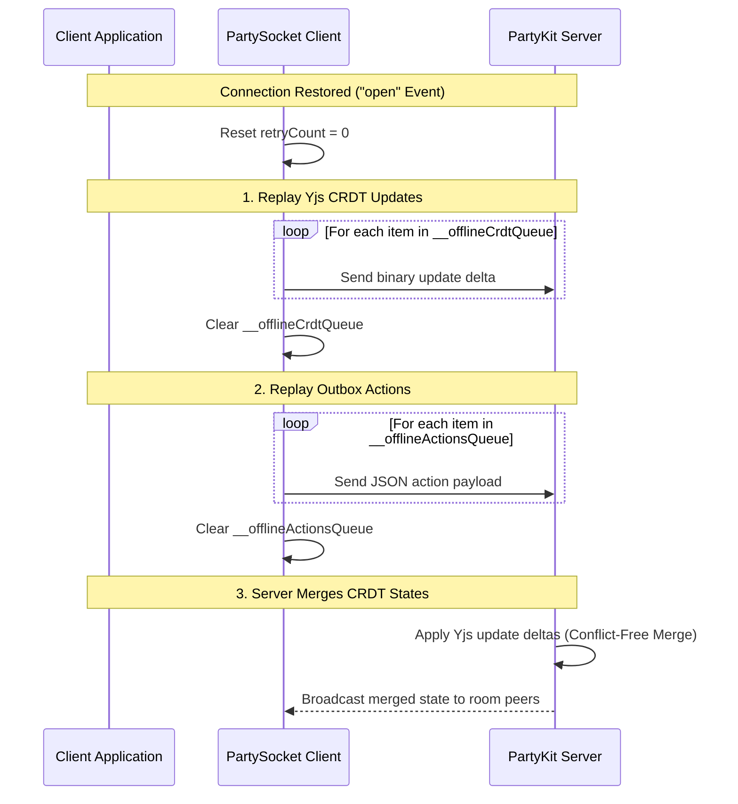

# PartySocket Reconnection & Offline Queue Protocol

This document details the architecture, state transitions, retry algorithms, and data persistence strategies governing real-time WebSocket connections and reconnections in WorkSphere.

---

## 1. Connection State Machine

The client socket connection flows through distinct states managed by `partySocketReconnect.ts`. This state machine ensures the client fails gracefully during network outages, performs region failovers, and recovers automatically when the device returns online.

### State Machine Transition Details

| Current State  | Next State     | Trigger / Description                                                                                  |
| :------------- | :------------- | :----------------------------------------------------------------------------------------------------- |
| `CLOSED`       | `CONNECTING`   | Initial connection attempt, browser coming back online, or manual `__worksphereForceReconnect()` call. |
| `CONNECTING`   | `CONNECTED`    | WebSocket handshake completes and the `"open"` event fires.                                            |
| `CONNECTING`   | `RECONNECTING` | WebSocket handshake fails, or an `"error"` event is received.                                          |
| `CONNECTED`    | `RECONNECTING` | WebSocket connection drops unexpectedly (due to packet loss or server suspension).                     |
| `RECONNECTING` | `CONNECTING`   | The backoff wait timer expires; executing the next connection retry.                                   |
| `RECONNECTING` | `CLOSED`       | Reconnection retry count exceeds `maxRetries` (5 attempts); connection is suspended.                   |

---

## 2. Exponential Backoff with Jitter

To prevent a **thundering herd problem** (where thousands of clients reconnect in lockstep after a network partition or server restart), WorkSphere applies an exponential backoff formula augmented with a **±20% randomized jitter**.

### Configuration Parameters

| Parameter                     | Type     | Default Value | Description                                               |
| :---------------------------- | :------- | :-----------: | :-------------------------------------------------------- |
| `maxRetries`                  | `number` |      `5`      | Maximum number of retry attempts before giving up.        |
| `minReconnectionDelay`        | `number` |  `1,000 ms`   | Initial retry delay (base multiplier).                    |
| `maxReconnectionDelay`        | `number` |  `30,000 ms`  | Upper limit for any connection attempt delay.             |
| `reconnectionDelayGrowFactor` | `number` |      `2`      | Exponential base factor (doubles the delay on each step). |

### The Algorithm

The reconnect delay is computed for a given `retryCount` (where `retryCount = 0` represents the initial connection attempt):

1. **Exponential Base Calculation**:
   \[
   \text{base} = \min\left(\text{maxReconnectionDelay}, \text{minReconnectionDelay} \times \text{reconnectionDelayGrowFactor}^{\text{retryCount} - 1}\right)
   \]
2. **Apply Random Jitter (±20%)**:
   \[
   \text{jitter} = \text{base} \times (\text{random}() \times 0.4 - 0.2)
   \]
3. **Clamping and Rounding**:
   \[
   \text{delay} = \text{round}\left(\min\left(\text{maxReconnectionDelay}, \max\left(\text{minReconnectionDelay}, \text{base} + \text{jitter}\right)\right)\right)
   \]

### Delay Sequence Example (Without Jitter vs. With Jitter Bounds)

| Retry Attempt | Base Delay (No Jitter) | Minimum Jittered Bound (-20%) | Maximum Jittered Bound (+20%) |
| :-----------: | :--------------------: | :---------------------------: | :---------------------------: |
|     **1**     |        1,000 ms        |            800 ms             |           1,200 ms            |
|     **2**     |        2,000 ms        |           1,600 ms            |           2,400 ms            |
|     **3**     |        4,000 ms        |           3,200 ms            |           4,800 ms            |
|     **4**     |        8,000 ms        |           6,400 ms            |           9,600 ms            |
|     **5**     |       16,000 ms        |           12,800 ms           |           19,200 ms           |

_Note: If `retryCount = 0` (initial connection attempt), the delay is hardcoded to `0 ms` to guarantee fast initial loads._

---

## 3. CRDT State Re-Synchronization Handshake

When a client loses network connectivity, collaborative documents must not lose edits. WorkSphere implements a local queuing layer that buffers outbound updates while offline and replays them in the correct topological order upon reconnection.

### 3.1 Offline Queues

While in any state other than `CONNECTED`, `attachJitteredBackoff` intercepts outbound socket messages:

1. **CRDT / Document State Updates (`__offlineCrdtQueue`)**:
   - Updates transmitted as binary packets (`ArrayBuffer` or `ArrayBufferView` containing Yjs sync deltas) are pushed to the CRDT queue.
   - Volatile updates (like cursor/presence coordinates) are **discarded** to prevent stale cursor movements from flooding the server upon connection restoration.
2. **Outbox Action Messages (`__offlineActionsQueue`)**:
   - JSON-encoded action messages (like upvoting collections or syncing bookmarks) are stored in the actions outbox queue.

### 3.2 The Re-Synchronization Sequence

Upon receiving a successful `"open"` event on the socket connection, the client triggers the re-synchronization handshake:

### 3.3 Conflict Resolution

Since the local changes are compiled as Yjs update deltas, they are merged on the server using **Conflict-Free Replicated Data Type (CRDT)** logic.

- The Yjs engine guarantees that concurrent offline edits from multiple peers converge deterministically to the same state once the sync updates are replayed, eliminating manual merge conflicts or data loss.
