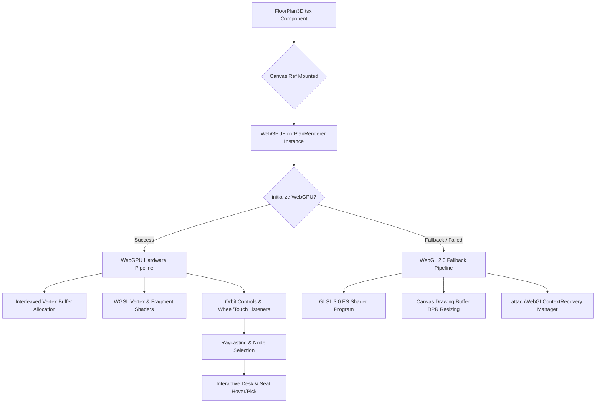

# Three.js & WebGL 3D Floor Plan Viewer Architecture & Developer Guide

This document provides a comprehensive technical reference for WorkSphere's interactive 3D venue floor plan viewer component (`FloorPlan3D.tsx`) and its underlying rendering engine (`WebGPUFloorPlanRenderer`). It details 3D scene construction, dynamic lighting, screen-to-world raycasting for interactive desk node selection, spherical camera orbit controls, WebGL context loss recovery, and step-by-step code examples for extending office layouts with custom 3D furniture models.

---

## 1. Overview & System Architecture

WorkSphere provides high-performance interactive 3D coworking venue visualizers using hardware-accelerated rendering. The component primary entry point is [`FloorPlan3D.tsx`](file:///d:/ECSOC/Worksphere/WorkSphere/src/components/venue/floorplan/FloorPlan3D.tsx), which initializes a WebGPU rendering pipeline via [`WebGPUFloorPlanRenderer`](file:///d:/ECSOC/Worksphere/WorkSphere/src/lib/webgpu/floorPlanRenderer.ts) when WebGPU is supported by the browser, and automatically falls back to an optimized WebGL 2.0 / GLSL 3.0 ES shader pipeline when WebGPU is unavailable or device context loss occurs.

### Component & Rendering Architecture Diagram



---

## 2. 3D Scene Construction and Lighting

### 2.1 Scene Hierarchy & Node Structure

The 3D floor plan scene hierarchy is constructed programmatically from structured [`FloorPlanData`](file:///d:/ECSOC/Worksphere/WorkSphere/src/lib/webgpu/floorPlanRenderer.ts#L49-L67) models consisting of floor bounds, walls, and seat nodes:

```
Scene Root Node (World Space Origin [0, 0, 0])
├── Floor Mesh Quad (Plane [-width/2, 0, -depth/2] to [width/2, 0, depth/2])
├── Wall Extrusions (Extruded Quads between [x1, z1] and [x2, z2] up to height)
└── Seat / Desk Nodes Array
    ├── Desk Primitive Box (Size 0.3m x 0.05m x 0.3m; Phone Booth height 1.8m)
    ├── Seat Category Color Fill (Hot Desk, Fixed Desk, Meeting Room, Phone Booth)
    └── Power Outlet Marker (Small Top Cube [0.05m] at y + height + 0.02m)
```

```
+------------------------------------------------------------------------+
|                               3D SCENE                                 |
|                                                                        |
|      (Eye Position: Target + Spherical Coordinates [r, theta, phi])    |
|                                 \                                      |
|                                  \  Raycast Direction Vector           |
|                                   v                                    |
|             +-----------------------------------+                      |
|             |          Phone Booth Box          |                      |
|             |          [Height: 1.8m]           |                      |
|             +-----------------------------------+                      |
|                                                                        |
|    +-------------+      +-------------+      +-------------+           |
|    | Hot Desk    |      | Fixed Desk  |      | Meeting Room|           |
|    | [Power Cube]|      | [Green]     |      | [Orange]    |           |
|  +-+-------------+------+-------------+------+-------------+-+         |
|  |                   FLOOR PLANE QUAD                        |         |
|  |           Color: RGB(0.15, 0.15, 0.18)                    |         |
|  +-----------------------------------------------------------+         |
+------------------------------------------------------------------------+
```

### 2.2 Furniture Node Types & Palette Definitions

Each seat node rendered in the 3D scene belongs to a designated category with normalized RGB color definitions:

| Seat Type      | Category Label | Normalized Color (RGB)            | Description                            |
| :------------- | :------------- | :-------------------------------- | :------------------------------------- |
| `hot_desk`     | Hot Desk       | `[0.2, 0.6, 0.9]` (Cyan Blue)     | Flexibly assigned single workstation   |
| `fixed_desk`   | Fixed Desk     | `[0.3, 0.8, 0.4]` (Emerald Green) | Dedicated reserved desk node           |
| `meeting_room` | Meeting Room   | `[0.8, 0.5, 0.2]` (Amber Warm)    | Shared conference seat group           |
| `phone_booth`  | Phone Booth    | `[0.7, 0.3, 0.7]` (Purple Tint)   | Enclosed acoustic booth (Height: 1.8m) |
| `hasPower`     | Power Outlet   | `[1.0, 0.9, 0.1]` (Bright Yellow) | Power availability indicator cube      |

### 2.3 Lighting Model & Shading Mechanics

The shading system combines **Lambertian Diffuse Reflection** and **Blinn-Phong Specular Highlighting** to achieve realistic depth perception and surface contours on venue elements.

#### Light Source Equations

1. **Diffuse Reflection (Lambertian)**:
   \[
   I_{\text{diffuse}} = \max(\vec{N} \cdot \vec{L}, 0.0) \times C_{\text{base}}
   \]
   Where \(\vec{N}\) is the normalized surface normal vector and \(\vec{L}\) is the normalized light direction vector pointing from the surface to light position \([0.5, 1.0, 0.7]\).

2. **Specular Highlight (Blinn-Phong)**:
   \[
   \vec{H} = \frac{\vec{L} + \vec{V}}{\|\vec{L} + \vec{V}\|}, \quad I_{\text{specular}} = \left(\max(\vec{N} \cdot \vec{H}, 0.0)\right)^{32}
   \]
   Where \(\vec{V}\) is the unit view direction vector from world position to camera position, and \(\vec{H}\) is the half-way vector.

3. **Combined Surface Shading Output**:
   \[
   C_{\text{final}} = C_{\text{base}} \times \left(I_{\text{ambient}} + 0.7 \times I_{\text{diffuse}}\right) + 0.3 \times I_{\text{specular}}
   \]

---

## 3. Raycasting & Interactive Desk Node Selection

To support interactive seat selection, hovering, and desk node inspection, screen coordinates from mouse and touch events are unprojected into 3D world space coordinates using raycasting.

### 3.1 Screen-to-World Ray Formulation

When a user clicks or taps on the 3D viewport canvas at pixel coordinates \((x_{\text{pixel}}, y_{\text{pixel}})\), the point is converted into **Normalized Device Coordinates (NDC)** in the range \([-1, 1]\):

\[
X_{\text{ndc}} = \frac{2 \cdot x_{\text{pixel}}}{W_{\text{canvas}}} - 1, \quad Y_{\text{ndc}} = 1 - \frac{2 \cdot y_{\text{pixel}}}{H_{\text{canvas}}}
\]

Using the combined inverse View-Projection Matrix \(M_{\text{inv}} = (P \cdot V)^{-1}\), ray origin \(\vec{O}\) and direction \(\vec{D}\) are computed:

\[
\vec{P}_{\text{near}} = M_{\text{inv}} \cdot \begin{bmatrix} X_{\text{ndc}} \\ Y_{\text{ndc}} \\ -1 \\ 1 \end{bmatrix}, \quad \vec{P}_{\text{far}} = M_{\text{inv}} \cdot \begin{bmatrix} X_{\text{ndc}} \\ Y_{\text{ndc}} \\ 1 \\ 1 \end{bmatrix}
\]
\[
\vec{O} = \frac{\vec{P}_{\text{near}.xyz}}{P_{\text{near}.w}}, \quad \vec{D} = \text{normalize}\left(\frac{\vec{P}_{\text{far}.xyz}}{P_{\text{far}.w}} - \vec{O}\right)
\]

### 3.2 Ray-Axis Aligned Bounding Box (AABB) Intersection Algorithm

```typescript
export interface Ray {
  origin: [number, number, number];
  direction: [number, number, number];
}

export interface AABB {
  min: [number, number, number];
  max: [number, number, number];
}

/**
 * Tests ray intersection against an Axis-Aligned Bounding Box (AABB).
 * Returns distance t to intersection point, or null if no hit occurs.
 */
export function intersectRayAABB(ray: Ray, box: AABB): number | null {
  let tmin = -Infinity;
  let tmax = Infinity;

  for (let i = 0; i < 3; i++) {
    if (Math.abs(ray.direction[i]) < 1e-6) {
      // Ray is parallel to slab. No hit if origin is outside slab bounds.
      if (ray.origin[i] < box.min[i] || ray.origin[i] > box.max[i]) {
        return null;
      }
    } else {
      const invD = 1.0 / ray.direction[i];
      let t1 = (box.min[i] - ray.origin[i]) * invD;
      let t2 = (box.max[i] - ray.origin[i]) * invD;

      if (t1 > t2) [t1, t2] = [t2, t1];

      tmin = Math.max(tmin, t1);
      tmax = Math.min(tmax, t2);

      if (tmin > tmax) return null;
    }
  }

  return tmin >= 0 ? tmin : null;
}
```

### 3.3 Interactive Selection Handler Implementation

```typescript
export function pickSeatNode(
  mouseX: number,
  mouseY: number,
  canvasWidth: number,
  canvasHeight: number,
  seats: FloorPlanData["seats"],
  viewProjectionMatrix: Float32Array,
): FloorPlanData["seats"][0] | null {
  const ray = calculateRayFromScreen(
    mouseX,
    mouseY,
    canvasWidth,
    canvasHeight,
    viewProjectionMatrix,
  );
  let closestDistance = Infinity;
  let selectedSeat: FloorPlanData["seats"][0] | null = null;

  for (const seat of seats) {
    const size = 0.3;
    const height = seat.type === "phone_booth" ? 1.8 : 0.45;
    const box: AABB = {
      min: [seat.x - size / 2, 0, seat.z - size / 2],
      max: [seat.x + size / 2, height, seat.z + size / 2],
    };

    const dist = intersectRayAABB(ray, box);
    if (dist !== null && dist < closestDistance) {
      closestDistance = dist;
      selectedSeat = seat;
    }
  }

  return selectedSeat;
}
```

---

## 4. Camera Orbit Controls, Zoom Bounds, and WebGL Context Restoration

### 4.1 Spherical Camera Orbit Coordinates

The camera position \(\vec{E}\) in 3D world space is computed from spherical coordinates: distance \(r\), pitch elevation angle \(\theta\) (`rotationX`), and azimuth yaw angle \(\phi\) (`rotationY`):

\[
E_x = T_x + P_x + r \cdot \cos(\theta) \cdot \sin(\phi)
\]
\[
E_y = T_y + P_y + r \cdot \sin(-\theta)
\]
\[
E_z = T_z + r \cdot \cos(\theta) \cdot \cos(\phi)
\]

Where \(\vec{T} = [0, 0.3, 0]\) is the camera target point and \(\vec{P} = [P_x, P_y]\) represents pan offsets.

### 4.2 Zoom Bounds & Control Constraints

Camera orbit parameters are strictly constrained within safe numerical boundaries:

```typescript
// Zoom Bounds Enforcement
const MIN_CAMERA_DISTANCE = 2.0; // Maximum zoom level
const MAX_CAMERA_DISTANCE = 20.0; // Minimum zoom out boundary

// Pitch Angle Constraints (rotationX)
const MIN_PITCH_ANGLE = -Math.PI / 2.5; // -1.256 rad (~-72° top-down perspective)
const MAX_PITCH_ANGLE = -0.1; // -0.100 rad (~-5.7° ground-level view)

// Reset View Target Defaults
export const DEFAULT_CAMERA_STATE: CameraState = {
  rotationX: -0.8,
  rotationY: 0.5,
  distance: 8.0,
  target: [0, 0.3, 0],
  panX: 0,
  panY: 0,
};
```

### 4.3 WebGL Context Loss & DPR-Correct Restoration Architecture

High-DPI / Retina displays require explicit canvas drawing buffer buffer re-allocation when recovering from WebGL context loss. WorkSphere coordinates canvas size management using [`allocateCanvasDrawingBuffer`](file:///d:/ECSOC/Worksphere/WorkSphere/src/lib/webgl/canvasBufferSize.ts) and [`attachWebGLContextRecovery`](file:///d:/ECSOC/Worksphere/WorkSphere/src/lib/webgl/contextManager.ts).

```typescript
// Attachment pattern in FloorPlan3D component lifecycle
useEffect(() => {
  if (!canvasRef.current) return;
  const canvas = canvasRef.current;
  const renderer = new WebGPUFloorPlanRenderer(canvas);
  rendererRef.current = renderer;
  let detachRecovery: (() => void) | null = null;

  renderer.initialize().then((success) => {
    if (success) {
      setUseWebGPU(true);
      renderer.loadFloorPlan(data);
      renderer.startRenderLoop();
    } else {
      // Reallocate DPR-correct drawing buffers after context loss on Retina (#1030)
      renderWebGLFallback(canvas, data);
      detachRecovery = attachWebGLContextRecovery(canvas, () => {
        renderWebGLFallback(canvas, data);
      });
    }
  });

  return () => {
    detachRecovery?.();
    renderer.destroy();
  };
}, [data]);
```

#### Event Listener Cleanup Checklist

To prevent memory leaks during React component remounting, `destroy()` explicitly removes all bound pointer listeners:

- `mousedown`, `mousemove`, `mouseup`, `mouseleave`
- `wheel` (with `{ passive: false }` option)
- `touchstart`, `touchmove`, `touchend`
- `visibilitychange` window state events

---

## 5. Extending Office Layouts with Custom 3D Furniture Models

This section provides complete, modular TypeScript code examples for registering and rendering custom 3D furniture models (e.g., standing desks, ergonomic lounge sofas, monitor arms, indoor plants, privacy partitions) within venue floor plan layouts.

### 5.1 Extending the FloorPlanData Interface

```typescript
// Step 1: Extend dataset types with custom furniture categories
export type FurnitureType =
  | "hot_desk"
  | "fixed_desk"
  | "meeting_room"
  | "phone_booth"
  | "standing_desk"
  | "lounge_sofa"
  | "monitor_arm"
  | "indoor_plant"
  | "privacy_partition";

export interface CustomFurnitureNode {
  id: string;
  x: number;
  z: number;
  rotationY?: number;
  type: FurnitureType;
  hasPower?: boolean;
  isQuiet?: boolean;
  dimensions?: { width: number; height: number; depth: number };
}
```

### 5.2 Custom Furniture Mesh Generator Function

```typescript
export interface InterleavedMesh {
  vertices: number[];
  indices: number[];
}

const CUSTOM_FURNITURE_COLORS: Record<FurnitureType, [number, number, number]> =
  {
    hot_desk: [0.2, 0.6, 0.9],
    fixed_desk: [0.3, 0.8, 0.4],
    meeting_room: [0.8, 0.5, 0.2],
    phone_booth: [0.7, 0.3, 0.7],
    standing_desk: [0.15, 0.75, 0.85], // Cyan teal
    lounge_sofa: [0.85, 0.35, 0.45], // Coral red
    monitor_arm: [0.25, 0.25, 0.3], // Dark slate metal
    indoor_plant: [0.2, 0.7, 0.3], // Botanical green
    privacy_partition: [0.6, 0.6, 0.65], // Neutral gray
  };

/**
 * Creates procedural 3D box geometry for custom furniture nodes with interleaved
 * attributes: [Pos(3), Normal(3), Color(3), UV(2)] -> Stride 40 bytes.
 */
export function createCustomFurnitureMesh(
  item: CustomFurnitureNode,
): InterleavedMesh {
  const vertices: number[] = [];
  const indices: number[] = [];
  const color = CUSTOM_FURNITURE_COLORS[item.type] ?? [0.5, 0.5, 0.5];

  const w = item.dimensions?.width ?? 0.4;
  const h = item.dimensions?.height ?? 0.5;
  const d = item.dimensions?.depth ?? 0.4;
  const y = 0.0; // Base height on floor

  const faces = [
    // Front (+Z)
    {
      norm: [0, 0, 1],
      corners: [
        [-w / 2, y, d / 2],
        [w / 2, y, d / 2],
        [w / 2, y + h, d / 2],
        [-w / 2, y + h, d / 2],
      ],
    },
    // Back (-Z)
    {
      norm: [0, 0, -1],
      corners: [
        [w / 2, y, -d / 2],
        [-w / 2, y, -d / 2],
        [-w / 2, y + h, -d / 2],
        [w / 2, y + h, -d / 2],
      ],
    },
    // Left (-X)
    {
      norm: [-1, 0, 0],
      corners: [
        [-w / 2, y, -d / 2],
        [-w / 2, y, d / 2],
        [-w / 2, y + h, d / 2],
        [-w / 2, y + h, -d / 2],
      ],
    },
    // Right (+X)
    {
      norm: [1, 0, 0],
      corners: [
        [w / 2, y, d / 2],
        [w / 2, y, -d / 2],
        [w / 2, y + h, -d / 2],
        [w / 2, y + h, d / 2],
      ],
    },
    // Top (+Y)
    {
      norm: [0, 1, 0],
      corners: [
        [-w / 2, y + h, d / 2],
        [w / 2, y + h, d / 2],
        [w / 2, y + h, -d / 2],
        [-w / 2, y + h, -d / 2],
      ],
    },
  ];

  const uvs: [number, number][] = [
    [0, 0],
    [1, 0],
    [1, 1],
    [0, 1],
  ];

  for (const face of faces) {
    const baseIdx = vertices.length / 10;
    for (let i = 0; i < 4; i++) {
      const corner = face.corners[i];
      // Translate to item relative position (x, z)
      const posX = item.x + corner[0];
      const posY = corner[1];
      const posZ = item.z + corner[2];

      vertices.push(posX, posY, posZ, ...face.norm, ...color, ...uvs[i]);
    }
    indices.push(baseIdx, baseIdx + 1, baseIdx + 2);
    indices.push(baseIdx, baseIdx + 2, baseIdx + 3);
  }

  return { vertices, indices };
}
```

### 5.3 Integrating Custom Models into Main Floor Plan Mesh Builder

```typescript
export function buildExtendedFloorPlanMesh(
  data: FloorPlanData & { customFurniture?: CustomFurnitureNode[] },
): { vertices: Float32Array; indices: Uint16Array; indexCount: number } {
  const allVertices: number[] = [];
  const allIndices: number[] = [];

  // 1. Build Base Floor Mesh
  const floor = createFloorMesh(data);
  allVertices.push(...floor.vertices);
  allIndices.push(...floor.indices);

  // 2. Build Walls
  for (const wall of data.walls) {
    const wallMesh = createWallMesh(wall);
    const offset = allVertices.length / 10;
    allVertices.push(...wallMesh.vertices);
    allIndices.push(...wallMesh.indices.map((i) => i + offset));
  }

  // 3. Build Standard Seats
  for (const seat of data.seats) {
    const seatMesh = createSeatMesh(seat);
    const offset = allVertices.length / 10;
    allVertices.push(...seatMesh.vertices);
    allIndices.push(...seatMesh.indices.map((i) => i + offset));
  }

  // 4. Build Custom Furniture Items
  if (data.customFurniture) {
    for (const item of data.customFurniture) {
      const furnitureMesh = createCustomFurnitureMesh(item);
      const offset = allVertices.length / 10;
      allVertices.push(...furnitureMesh.vertices);
      allIndices.push(...furnitureMesh.indices.map((i) => i + offset));
    }
  }

  return {
    vertices: new Float32Array(allVertices),
    indices: new Uint16Array(allIndices),
    indexCount: allIndices.length,
  };
}
```

---

## 6. Developer Verification & Best Practices

1. **Retina & High-DPI Display Sharpness**: Always verify that canvas drawing buffer allocation matches `canvas.clientWidth * devicePixelRatio` to prevent blurry text and pixelated 3D furniture edges.
2. **Context Loss Simulation**: Test context loss by invoking `canvas.getContext('webgl2')?.getExtension('WEBGL_lose_context')?.loseContext()` in browser dev tools to confirm clean recovery.
3. **Raycasting Bounds**: Ensure AABB bounding box heights account for custom furniture geometry dimensions so picking accuracy remains precise across all viewing angles.
