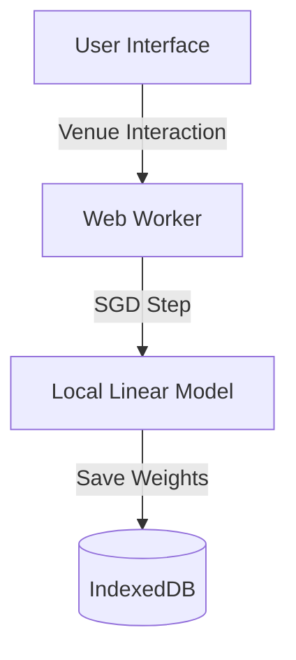
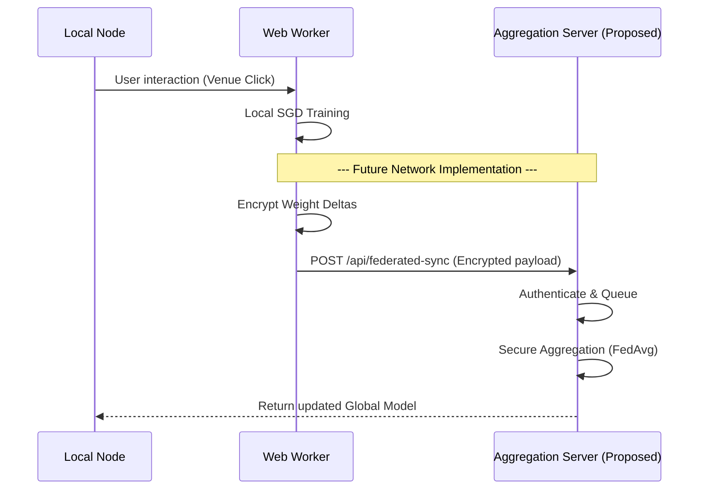

# Federated Learning Architecture Guide

This document provides a comprehensive architectural guide for the federated learning infrastructure in WorkSphere. It clearly distinguishes between the features that are fully implemented today (local on-device training) and the proposed future architecture for encrypting, aggregating, and synchronizing user venue preference weights across federated nodes.

## Current Implementation

The existing repository implements a strictly local, on-device federated training loop to prioritize and protect user privacy. Raw telemetry and engagement data never leave the device.

### Existing Components

- **Web Worker (`src/workers/federatedTrainer.worker.ts`)**: Handles background execution of model inference and gradient updates to ensure the main UI thread remains completely responsive.
- **Local SGD Model (`src/lib/federated/linearVenueModel.ts`)**: Implements stochastic gradient descent (SGD) on a lightweight linear model. Venue feature vectors are scored, and the model is fine-tuned locally based on user interactions.
- **IndexedDB Persistence (`src/lib/federated/weightDb.ts`)**: The updated model weight blobs are saved exclusively to the local browser storage (`IndexedDB`), isolated from network transport.

### Existing Data Flow

Currently, user actions (e.g., interacting with a venue) trigger a small gradient step on the local model within the Web Worker. The new weights are subsequently persisted to IndexedDB.



---

## Proposed Future Architecture (Not Yet Implemented)

> **IMPORTANT:** The synchronization, encryption, and aggregation workflows described in this section are a **proposed future architecture**. They are **not currently implemented** in the repository.

To transition from local-only learning to a true federated learning system, the following proposed architecture plans to synchronize local model weights across distributed nodes without compromising user privacy.

### Planned Synchronization Features

1. **Encrypted Weight Upload**: After local fine-tuning, the client is planned to encrypt the computed weight deltas before any network transmission occurs.
2. **Federated Synchronization**: A future API endpoint (e.g., `/api/federated-sync`) will be introduced to accept the encrypted weight payloads from individual federated nodes.
3. **Server Aggregation**: The server will use a planned Secure Aggregation strategy (e.g., Federated Averaging) to combine incoming encrypted deltas into a new global model, ensuring the server cannot inspect individual node updates.
4. **Global Model Redistribution**: The server will broadcast the newly aggregated global model back to all participating clients for local updates.

### Proposed Component Architecture

```mermaid
graph TD
    subgraph Client Node
        Worker[Web Worker] -->|Encrypt Deltas| SyncWorker[Sync Protocol]
        SyncWorker -->|HTTP POST| Network[Internet]
    end

    subgraph Server Node (Future)
        Network -->|Receive Payload| API[/api/federated-sync/]
        API --> Aggregator[Secure Aggregation Engine]
        Aggregator --> GlobalModel[(Global Model Store)]
        GlobalModel -->|Redistribute| Network
    end
```

### Proposed Sequence Diagram



### Proposed Payload Schema Example

The following schema outlines the planned structure for the federated synchronization payload:

```json
{
  "clientId": "uuid-string",
  "encryptedDeltas": "base64-encoded-string",
  "proofOfTraining": "zk-proof-placeholder",
  "modelRevision": "1.4.2",
  "timestamp": 1718294400000
}
```

### Limitations and Security Considerations (Future Design)

When implementing the proposed synchronization architecture, several challenges must be mitigated:

- **Bandwidth Constraints (Planned Mitigation)**: Syncing model weights frequently could consume excessive mobile data. The proposed synchronization should be batched and restricted to Wi-Fi connections when possible.
- **Privacy Guarantees (Planned Mitigation)**: The server must not hold the decryption keys for individual client updates. Implementing an industry-standard Secure Aggregation protocol is required for the future server architecture.
- **Data Poisoning (Planned Mitigation)**: The proposed architecture must account for malicious clients attempting to upload poisoned gradients. Future mitigation strategies include anomaly detection and outlier clipping during the aggregation phase.
